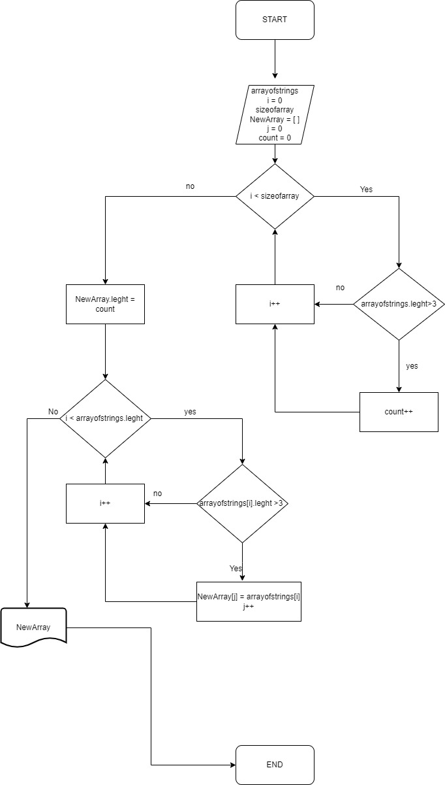

## КАК РАБОТАЕТ МОЯ ПРОГРАММА

Я создад метод  **deletingofElements** который принимает на вход массив из строк.
Внутри метода есть переменая **count**. Далее идёт цикл который считает количество
элементов массива длина которых больше 3. С каждым найденным элементом значение **count**
увеличевается на 1. Далее задаю новый массив **newarray** длина которого равна **count**. 
Далее идет новый цикл который добавляет в наш новый массив элементы из старого массива длина 
которых не больше 3 после чего возвращяю массив. Уже вне метода я создаю масси из сторк **arrayofStrings**
из которого должны вернутся элементы длина которых больше 3. Ввожу новый масси **finalArray**
в котором будут элементы из предыдушего массива длина которых не больше 3. После чего вывожу этот массив.

